# Coffee Lab Web 用户操作手册

版本：V1.0 / 2026-09-22  
适用范围：当前 Web 版本  
最近审查：2026-09-23  
默认语言：中文

> 本手册只描述当前代码已经提供的能力。Roadmap 中的计划功能不代表现在可用。页面截图来自开发分支的脱敏演示页面，统一位于 `../images/manual/`。

## 1. 产品简介

Coffee Lab（中文品牌：液体风味公式）用于管理个人咖啡豆、购买批次、库存、冲煮参数、杯测结果、可复用做法和每日咖啡记录。

推荐的数据关系是：

```text
豆种档案 -> 购买批次 -> 养豆/库存 -> 冲煮记录 -> 杯测 -> 日历回看
```

“豆种档案”描述一支咖啡豆本身；“购买批次”描述这一次买到的具体一包。同一支豆子复购时，不必重复建豆种，只需新增一个批次。

## 2. 注册、登录和找回密码

### 用来做什么

登录后才能访问个人数据。不同用户的数据由 Supabase Auth 和 RLS 隔离。

### 操作步骤

1. 打开 Web 地址，进入登录页。
2. 没有账号时切换到注册状态，填写邮箱和至少 6 位密码。
3. 已有账号填写邮箱和密码后提交。
4. 忘记密码时点击“忘记密码”，填写邮箱并提交。
5. 打开邮件中的恢复链接，在重置页面填写新密码和确认密码。
6. 重置成功后重新登录。

### 结果

登录后进入首页；密码恢复成功后原会话会退出，需要用新密码登录。

### 常见问题

- 邮件没有收到：检查垃圾邮件，并确认 Supabase Auth 的邮件服务和回跳地址已配置。
- 未注册邮箱和已注册邮箱会显示统一的发送提示，不据此判断账号是否存在。
- 恢复链接过期或被使用后，需要重新发送。

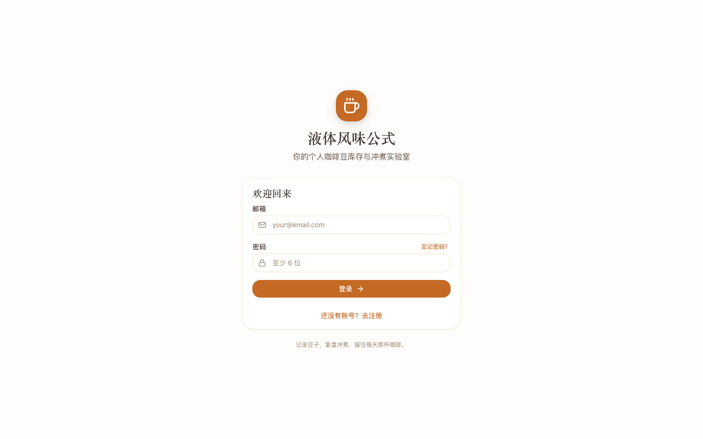

## 3. 第一次使用：豆种 -> 批次 -> 冲煮

### 用来做什么

这是完成第一杯记录的最短路径：

1. 创建豆种档案，说明“这支豆是什么”。
2. 创建购买批次，说明“这次买的哪一包”。
3. 等批次可冲煮后记录第一杯。

### 操作步骤

1. 在首页点击“开始使用”卡中的“创建豆种”，或进入“豆种”页面点击新增。
2. 填写品牌、豆名等关键字段并保存。
3. 创建完成后，如果来自批次入口，会自动回到新建批次页并预选刚创建的豆种。
4. 填写购买日期、烘焙日期、价格、重量等信息并保存。
5. 批次状态达到“可开封”或“使用中”后，进入“冲煮”新增记录。
6. 保存冲煮后，在日历和首页回看。

### 结果

首页的四步卡会根据数据解锁后续步骤。没有豆种时不能直接创建批次；没有可用批次时不能进入空的冲煮表单。

### 常见问题

- 同一支豆子再次购买：回到该豆种详情页新增批次，不要重复建豆种。
- 只有 `pending` 或 `resting` 的批次：先补充开封/状态信息，等它成为 `ready` 或 `in_use`。
- 日历步骤不会代替冲煮记录；它用于回看和补充当天照片、备注。

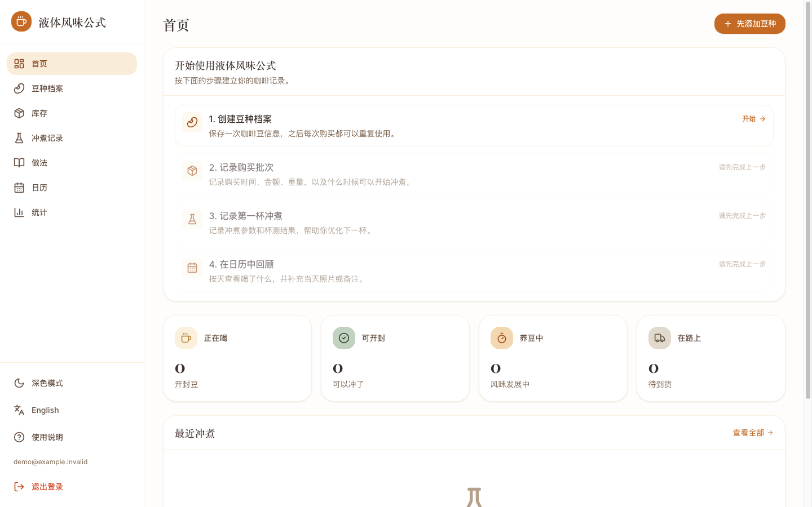
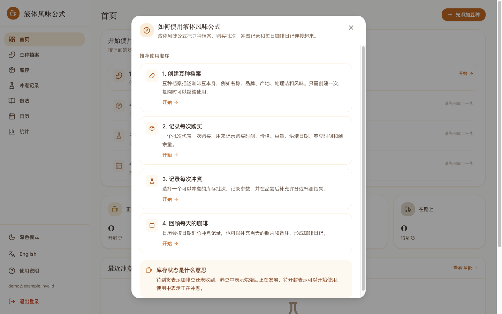

## 4. 首页和新手步骤卡

### 用来做什么

首页集中展示当前库存、养豆状态、低库存、开封时间和最近冲煮，并提供快速入口。

### 操作步骤

1. 查看顶部快速操作按钮：有可用批次时可直接“记录冲煮”，没有时会引导完成豆种或批次。
2. 查看库存概览卡，进入对应状态的库存列表。
3. 查看提醒：低库存、开封时间过久等提醒可点击进入详情。
4. 查看最近冲煮，点击进入冲煮详情。
5. 按四步卡完成“创建豆种、记录批次、记录冲煮、日历回顾”。
6. 需要完整说明时，打开侧边栏的使用说明。

### 结果

用户能从首页判断下一步该做什么，而不必先理解全部页面。


## 5. 豆种档案

### 用来做什么

保存一支豆子的稳定信息，不承载某一次购买的价格和剩余重量。

### 操作步骤

1. 进入“豆种”。
2. 点击新增豆种。
3. 填写豆名、品牌/烘焙商、产地/产区、处理法、品种、海拔、烘焙度、风味描述等信息。
4. 填写推荐养豆天数；不确定时可以先留空或使用合理估计。
5. 可选择最多 3 张 JPG、PNG 或 WebP 图片；第一张作为封面，可调整顺序或设为封面。
6. 上传图片会自动转换并压缩到 800KB 内；旧的图片 URL 仍可继续使用。
7. 保存后进入豆种详情，横向查看图片并查看关联批次。
7. 需要修改时进入详情点击编辑。
8. 需要删除时在详情操作；存在活跃批次时系统会阻止删除。

### 结果

豆种可以被多个购买批次复用，复购时不会破坏历史记录。

### 常见问题

- 价格、购买日期和剩余重量属于批次，不属于豆种。
- 删除按钮不可用或提示阻止，通常是因为该豆种仍有关联批次。

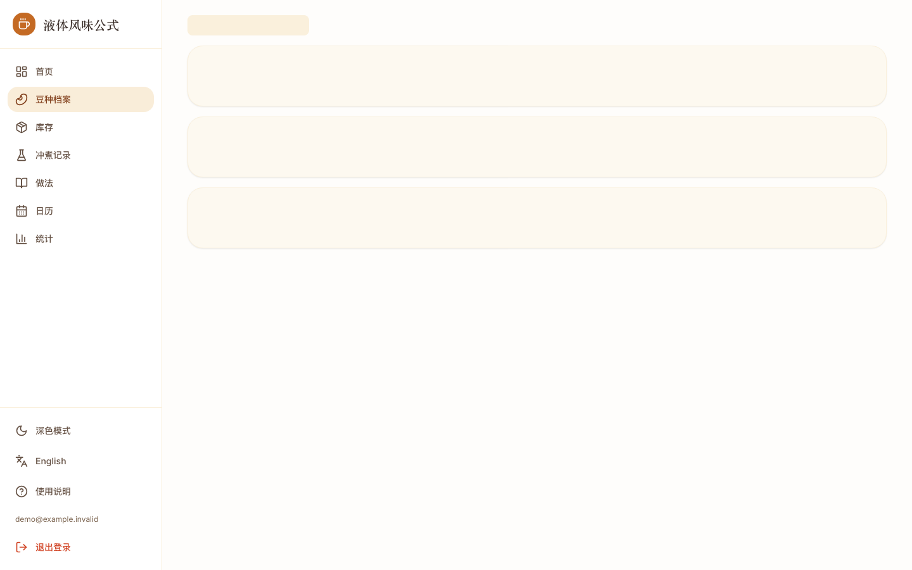

## 6. 购买批次和库存

### 用来做什么

记录一次具体购买：什么时候买、花了多少钱、买了多少、当前剩多少，以及处于什么状态。

### 操作步骤

1. 进入“库存”。
2. 点击“新增批次”。
3. 如果没有豆种档案，按钮会显示“先添加豆种”，先完成第 5 章流程。
4. 选择豆种，填写购买日期、烘焙日期、到手日期、开封日期、价格、重量、购买渠道和批次编号。
5. 保存后在库存列表使用搜索和状态筛选。
6. 点击批次卡查看详情，编辑字段或删除批次。
7. 复购时从原豆种或批次详情创建新批次。

### 结果

每一次购买都成为独立批次，价格、重量、养豆和剩余量可以单独追踪。

### 常见问题

- 没有豆种时直接访问 `/inventory/new`，页面会显示“先建立豆种档案”的说明，不会展示无法保存的表单。
- 长豆名、批次编号和渠道信息在手机上会换行或截断，不应撑破页面。
- 删除批次前确认它没有需要保留的冲煮关联。

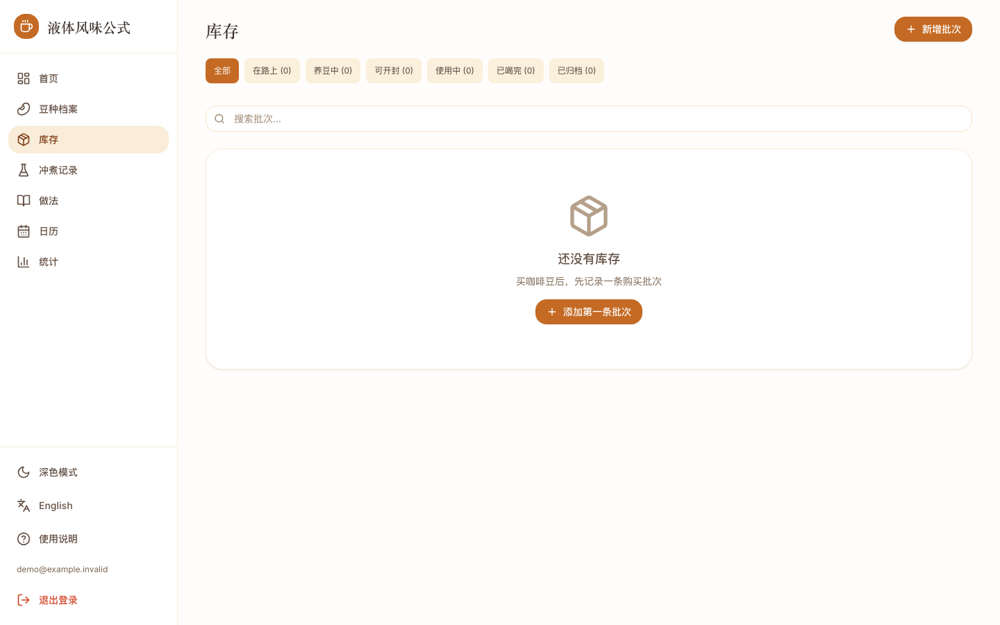
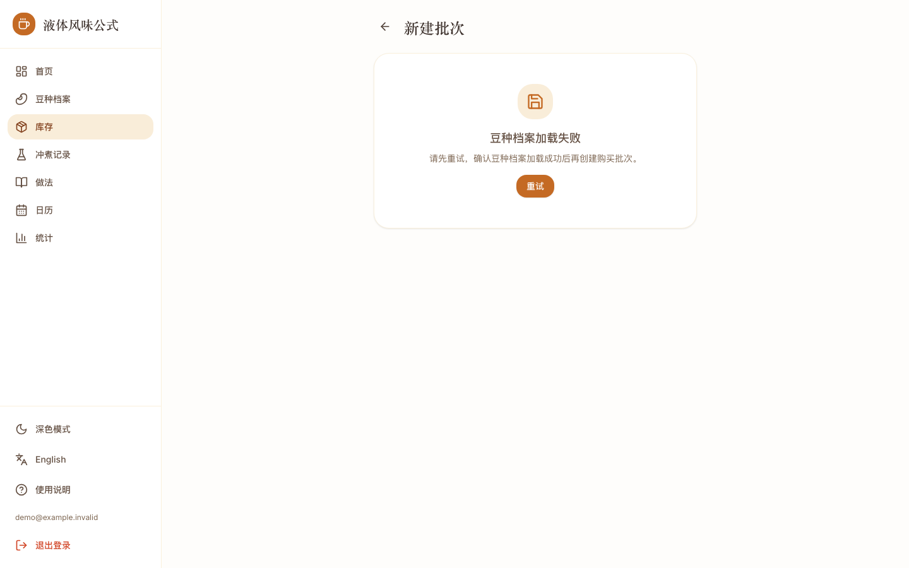
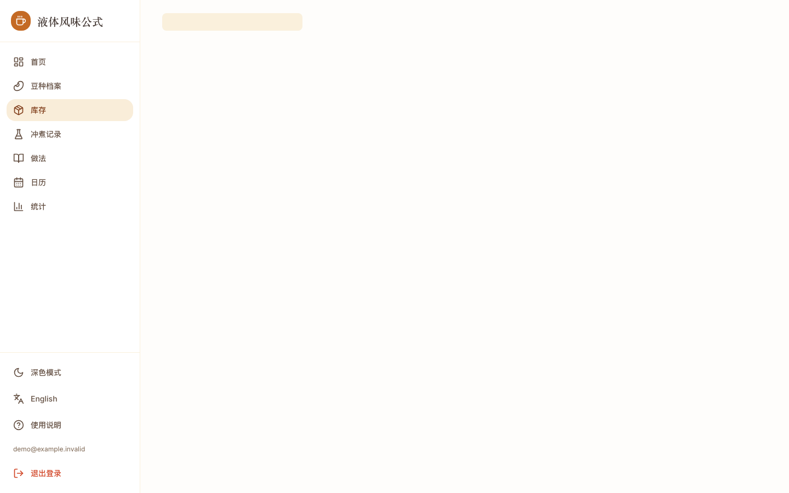

## 7. 养豆与库存状态

### 用来做什么

根据烘焙日期和豆种的推荐养豆天数，判断什么时候更适合开封；同时了解库存是否偏低。

### 操作步骤

1. 在豆种档案填写推荐养豆天数。
2. 在批次填写烘焙日期。
3. 查看首页、库存或批次详情的养豆提示。
4. 状态一般按页面提供的状态选项推进，例如待处理、养豆中、可开封、使用中。
5. 记录冲煮后查看剩余重量和低库存提醒。

### 结果

系统按“烘焙日期 + 推荐养豆天数”计算参考可开封日期，并在页面展示倒计时或状态。

### 常见问题

- 养豆倒计时是参考，不是对所有豆子都适用的硬性结论。
- 当前新增冲煮会按粉量扣减库存；编辑或删除冲煮暂不回滚库存。需要修正时应直接核对批次剩余量，并关注 Roadmap 中的库存流水计划。

## 8. 冲煮记录

### 用来做什么

保存一次真实冲煮的豆子、器具、参数、评分和感受，便于复现。

### 操作步骤

1. 进入“冲煮”，点击新增；也可以从日历或做法进入。
2. 选择状态为“可开封”或“使用中”的库存批次。
3. 填写日期/时间、器具、研磨度、水温、粉量、液重、粉水比、总时间等参数。
4. 可补充注水方案、滤纸类型、杯数、评分和备注。
5. 保存记录。
6. 在冲煮详情编辑、删除，或添加杯测。

### 结果

记录关联到一个购买批次；新增冲煮会按粉量扣减该批次剩余重量；日历会自动显示这一天的冲煮。

### 常见问题

- 没有 `ready` 或 `in_use` 批次时，新增页会先引导去库存，不会展示无法保存的表单。
- 日历带入日期、做法带入参数只是预填，保存前仍可调整。
- 修改或删除冲煮当前不会自动回滚库存，原因见第 7 章。

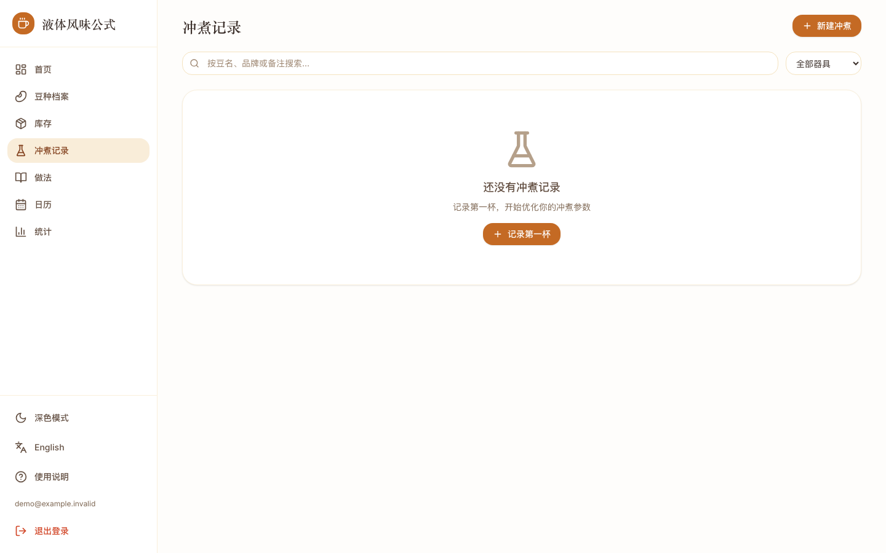

## 9. 杯测记录

### 用来做什么

把“这杯喝起来怎样”结构化保存，和冲煮参数放在同一条记录下复盘。

### 操作步骤

1. 打开一条冲煮详情。
2. 进入杯测区域并点击新增或编辑。
3. 记录香气、酸质、甜感、苦味、醇厚度、余韵、干净度和平衡度等维度。
4. 填写总分、选择风味标签，补充对比备注。
5. 保存后回到冲煮详情查看。

### 结果

一条冲煮最多关联一条杯测；评分和标签可用于统计。

### 常见问题

- 杯测不是必须步骤，可以先记录冲煮，之后再补。
- 风味标签用于个人复盘，不等同于专业认证结果。

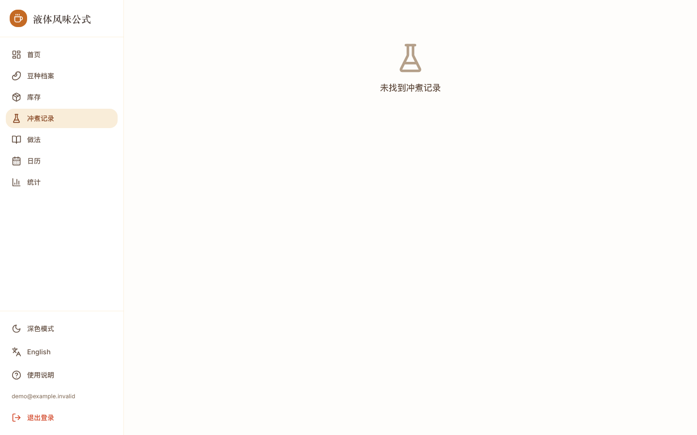

## 10. 咖啡配方库

### 用来做什么

浏览系统内置的冲煮做法和咖啡饮品，也可以保存只有自己能看到的私人配方。

### 操作步骤

1. 进入“做法”，顶部有“冲煮做法”和“咖啡饮品”两个入口。
2. 进入“冲煮做法”时，可按名称和器具筛选；进入“咖啡饮品”时，可按名称和饮品类型筛选。
3. 点击配方卡片查看图片、原料、参数和制作步骤。
4. 对内置配方点击复制，生成只有自己能看到的可编辑副本。
5. 新建“冲煮做法”时填写器具、研磨度、水温、粉量、液量、比例、时间、注水方案、滤纸和说明。
6. 新建“咖啡饮品”时只填写饮品类型、原料、制作步骤、说明和图片，不需要选择器具或填写冲煮参数。
7. 饮品类型包括美式、冰美式、拿铁、脏拿铁、摩卡、冷萃、柑橘美式和其他；选择“其他”时补充自定义类型。
8. 可上传最多 5 张图片，并调整顺序或设置封面；每张自动压缩至 800KB 内。
9. 冲煮做法可以点击“冲一杯”，把默认参数带入冲煮表单；咖啡饮品不会出现在冲煮选择器中。
10. 咖啡饮品配方当前只保存资料，不创建冲煮记录，也不会扣减库存。

### 结果

配方本身不代表一次已经完成的冲煮或饮品制作。内置配方所有登录用户可见；自己创建和复制的配方只有本人可见。

### 常见问题

- 内置配方不能直接编辑或删除，请先复制。
- 内置配方有中文名和英文名，跟随当前界面语言显示；用户自定义配方只维护一个名称，切换语言时仍显示该名称。
- 冷萃可以分别作为“冷萃浸泡法”冲煮做法和“冷萃”咖啡饮品保存，两者是不同配方。
- 上传失败不会删除原来的图片；配方文字已保存但图片失败时，页面会明确提示。
- 用户配方当前不能发布给其他用户，也没有点赞、评论和收费功能。

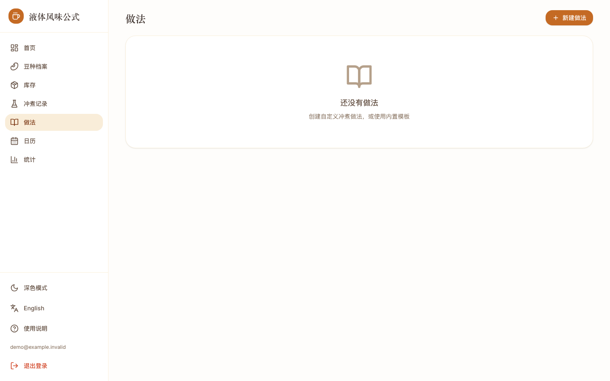

## 11. 咖啡日历

### 用来做什么

按月份回看每天喝了什么，并把咖啡或拉花照片、当天备注放在同一天。

### 操作步骤

1. 进入“日历”。
2. 使用左右箭头切换月份，点击“今天”回到当前月份。
3. 查看有冲煮记录的日期，日期格中会展示豆名和器具提示。
4. 点击某一天打开详情面板，查看当天全部冲煮。
5. 点击“新增冲煮”时，页面会带入所选日期。
6. 添加当天备注。
7. 可以输入图片 URL，或选择图片上传到 Supabase Storage。
8. 保存、替换或删除当天记录。

### 结果

冲煮记录会自动出现在日历；照片和备注需要用户主动添加。日历不要求每天都完整填写。

### 常见问题

- 没有冲煮的日期仍可添加照片和备注。
- 图片上传失败时先检查文件和 Storage 配置；不要在公开文档中记录 Storage 密钥。
- 当前每个用户每天一条日记记录，图片替换会更新当天记录。

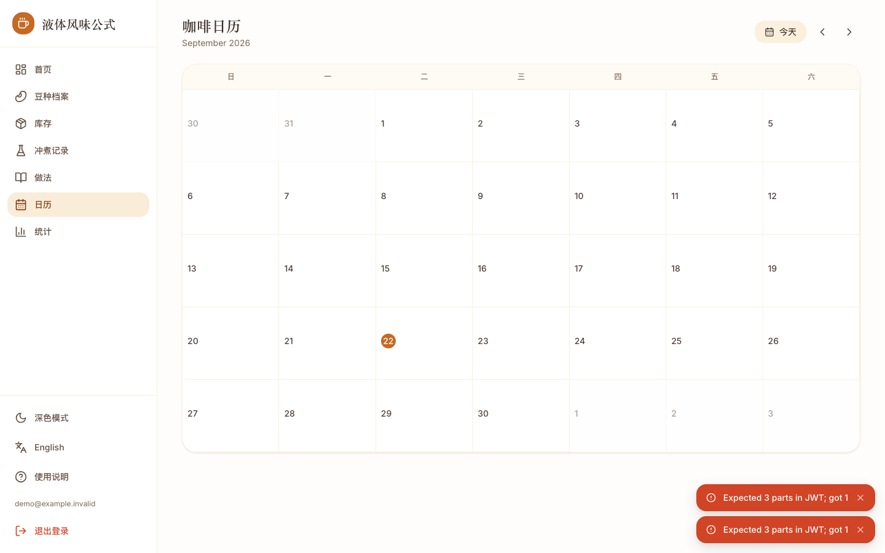
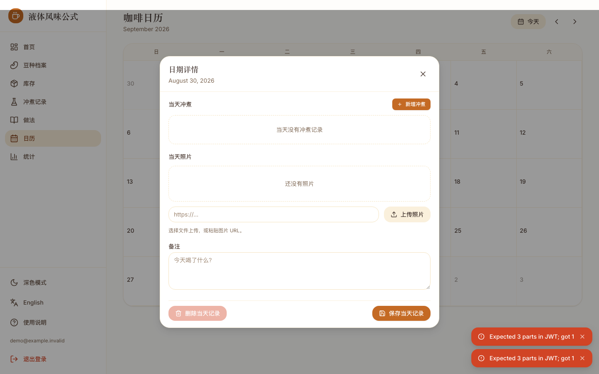

## 12. 统计

### 用来做什么

从批次和冲煮记录中观察消费、评分、器具和趋势。

### 操作步骤

1. 进入“统计”。
2. 查看总花费、购买批次、每 100g 平均价格和平均评分。
3. 查看品牌购买次数、器具使用占比、处理法评分和评分分布。
4. 查看冲煮趋势、水温与评分关系、复购热门榜单。
5. 没有数据时，根据空状态提示先创建豆种、批次或冲煮记录。

### 结果

统计是对当前账号已有数据的聚合，不会产生新的业务记录。

### 常见问题

- 统计结果依赖字段完整度；没有价格、评分或水温的数据不会被强行补齐。
- 当前没有高级筛选和 CSV 导出，见 Roadmap。

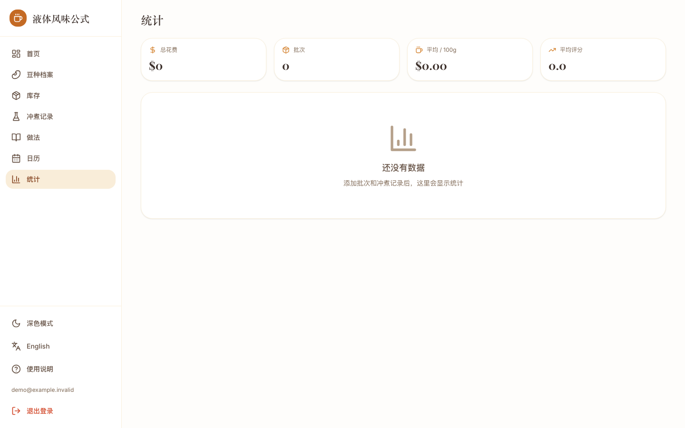

## 13. 中英文切换

### 用来做什么

在中文和 English 之间切换界面文案，语言偏好保存在当前浏览器的 `localStorage`。

### 操作步骤

1. 桌面端在侧边栏点击语言按钮。
2. 移动端点击顶部语言图标，或打开菜单查看入口。
3. 选择后页面文案立即切换；再次操作可切回中文。

### 结果

中文模式显示“液体风味公式”，英文模式显示 “Coffee Lab”。用户数据内容不自动翻译。

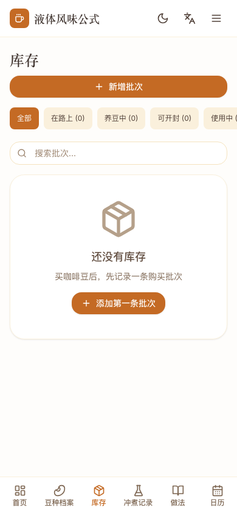

## 14. 深色模式和移动端使用

### 用来做什么

在不同光线和屏幕尺寸下保持可读、可操作。

### 操作步骤

1. 桌面端在侧边栏点击深色模式按钮。
2. 移动端点击顶部太阳/月亮图标。
3. 手机使用底部导航进入首页、豆种、库存、冲煮、做法和日历；统计可从移动端菜单进入。
4. 表单和弹窗内容较长时上下滚动，不要横向拖动页面。

### 结果

主题偏好在当前浏览器中保留；页面在 390px 左右宽度下仍应保持主要按钮可点击。


## 15. 空状态和常见问题

### 没有豆种

进入库存新增批次会先显示说明和“创建豆种”入口。完成后系统会返回批次表单。

### 没有可用批次

进入冲煮新增会引导先去库存；只有 `ready` 或 `in_use` 批次会出现在可冲煮选择中。

### 页面一直加载

先检查网络和 Supabase 项目状态；刷新后仍失败时记录页面、时间和错误提示，不要把密钥贴到工单。

### 为什么日历没有照片

冲煮记录会自动聚合，照片和备注是单独的 daily entry，需要在日期详情中主动保存。

### 为什么库存重量和预期不同

新增冲煮会按粉量扣减；编辑或删除冲煮当前不回滚，需要手动核对，并等待库存流水能力上线。

## 16. 数据隐私和账号安全

- 不要把 Supabase publishable key 以外的密钥发送给他人。
- 不要在共享电脑保留登录状态。
- 忘记密码使用邮箱恢复，不要重复注册相同账号。
- 图片内容会进入项目配置的 Supabase Storage；上传前确认不包含不希望长期保存的个人信息。
- 豆种和配方图片使用私有 Storage，并通过短期 signed URL 查看；外部图片 URL 仍取决于第三方地址的可用性。
- 用户只能在权限策略允许的范围内访问自己的业务数据；不要尝试绕过 RLS。

## 截图索引

| 文件 | 说明 |
| --- | --- |
| `01-auth-login.png` | 登录/注册页 |
| `02-dashboard-onboarding.png` | 首页、新手步骤卡 |
| `03-bean-profile.png` | 豆种列表或空状态 |
| `04-inventory.png` | 库存列表 |
| `05-batch-form.png` | 新建批次表单 |
| `05-batch-empty-state.png` | 无豆种时批次引导 |
| `06-brew-record.png` | 冲煮列表/表单 |
| `06-brew-empty-state.png` | 无可用批次冲煮引导 |
| `07-brew-detail-cupping.png` | 冲煮详情和杯测 |
| `08-recipes.png` | 做法列表 |
| `09-calendar.png` | 日历月视图 |
| `10-calendar-day-detail.png` | 日历日期详情 |
| `11-stats.png` | 统计页 |
| `12-usage-guide.png` | 使用说明 |
| `13-mobile-layout.png` | 移动端布局 |
